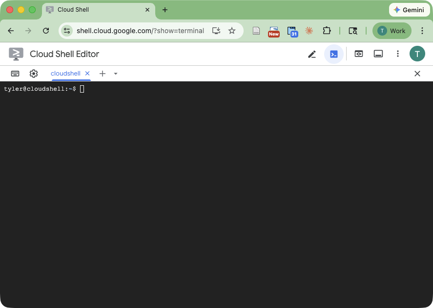
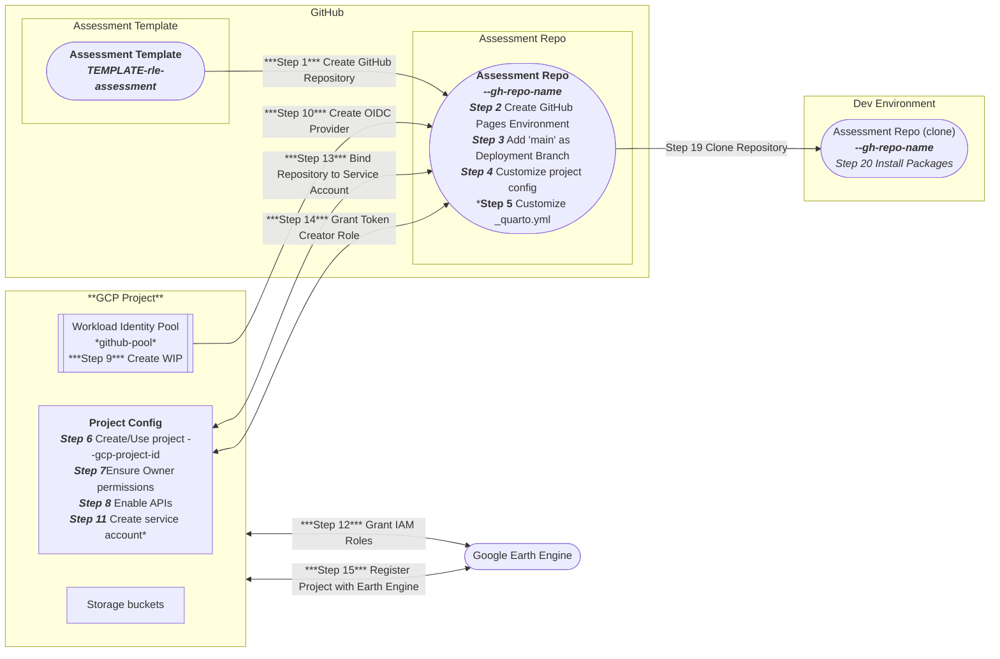

***Welcome to the GitHub organization for building Red List of Ecosystems (RLE) assessment reports!***

The **RLE Assessment** GitHub organization makes it easier to build IUCN [Red List of Ecosystems](https://iucnrle.org/) assessment reports following the [Global Ecosystem Typology](https://global-ecosystems.org/) classification framework. This workflow creates a skeleton website, notebooks, and PDF document with standard RLE calculations that can be customized by the assessment authors.


## Prerequisites

- [ ] A [Google Cloud Project (GCP)](https://console.cloud.google.com) account
  - If you need to create a new account, visit https://console.cloud.google.com 
- [ ] A [GitHub](https://github.com/) account
  - If you need to create a new account, visit https://github.com/signup


## Create a new assessment repository

Creating a new assessment report repository involves configuring a GitHub code repository (for content) and a Google Cloud Platform project (for data access and storage). An initialization script automates the full setup process: creating a GitHub repository from the template, provisioning a GCP project with Workload Identity Federation, configuring GitHub secrets, and cloning the repository locally. The script displays each command it runs with a detailed explanation of what it does and why.

### Open a Development Environment

Instructions are provided for either local development or in a GCP Cloud Shell development.

<details>
<summary><strong>Local development</strong></summary>

> Make sure additional prerequisites are installed:
>
> - [ ] [GitHub CLI (`gh`)](https://cli.github.com) installed and authenticated (`gh auth login`). This is used to create and configure GitHub repositories.
> - [ ] [Google Cloud CLI (`gcloud`)](https://cloud.google.com/sdk/docs/install) installed and authenticated (`gcloud auth login`). This is used to create and configure Google Cloud Platform projects.
> - [ ] [uv](https://docs.astral.sh/uv/) installed. This is used to run the initialization script (dependencies are resolved automatically).
> - [ ] [pixi](https://pixi.sh) installed. This is used to manage the project's development environment and dependencies.
>
> The script checks for these prerequisites and gives clear instructions if anything is missing.

</details>

<details>
<summary><strong>GCP Cloud Shell development</strong></summary>

> In a browser, open a GCP Cloud Shell terminal by going to:
>
> https://shell.cloud.google.com/?show=terminal
>
> 
>
> The Google Cloud Shell has several of the prerequisites ([GitHub CLI (`gh`)](https://cli.github.com), [Google Cloud CLI (`gcloud`)](https://cloud.google.com/sdk/docs/install), [uv](https://docs.astral.sh/uv/)) automatically installed.
>
> However, the package manager [pixi](https://pixi.sh) is not pre-installed in Cloud Shell. Install it by running the script:
>
> ```
> curl -fsSL https://pixi.sh/install.sh | sh
> source ~/.bashrc
> ```
>
> **Note:** Cloud Shell has limited storage (~5 GB). If you encounter
> "No space left on device" errors during package installation, free up
> space by clearing caches:
>
> ```
> rm -rf ~/.cache/rattler/cache/ ~/.cache/pip/
> ```
>
> You can also check what's using space with `du -sh ~/* | sort -hr | head -10`
> and remove any unnecessary project directories.

</details>


### Run the initialization script

The `uv run` command downloads the script directly from GitHub and automatically installs its dependencies (in an isolated, temporary environment) before running it -- no cloning or manual setup required.

Replace the placeholder values below with your own before running:

```
uv run https://raw.githubusercontent.com/RLE-Assessment/.github/main/scripts/init_repo.py \
  --country-name "Ruritania" \
  --gcp-project-id rle-ruritania \
  --gcp-project-name "RLE Ruritania" \
  --gh-repo-name rle-ruritania \
  --ecosystem-gee-asset-id projects/goog-rle-assessments/assets/ruritania/ruritania_ecosystems \
  --project-dir .
```

| Option | Description |
|---|---|
| `--country-name` | Name of the country for the assessment. Also used to auto-estimate the initial map view coordinates (latitude, longitude, zoom) via geocoding. |
| `--gcp-project-id` | A globally unique GCP project identifier (lowercase letters, digits, and hyphens) |
| `--gcp-project-name` | *(Optional)* Display name for the GCP project (only needed when creating a new project; prompted if omitted) |
| `--gh-repo-name` | Name for the new GitHub repository |
| `--gh-owner` | *(Optional)* GitHub username or organization. Defaults to the authenticated user. |
| `--ecosystem-gee-asset-id` | *(Optional)* Earth Engine asset ID for the ecosystem map. Defaults to the template placeholder. |
| `--project-dir` | Directory in which to clone the repository (use `.` for current directory) |
| `--yes` / `-y` | *(Optional)* Skip confirmation prompts (useful for non-interactive use) |

Most options are prompted interactively if omitted. The `--gh-owner` option defaults to the authenticated GitHub user when not specified; pass it explicitly to create the repository under an organization.

The script displays each command with an explanation before running it and asks for confirmation. Use `--yes` to skip the prompts.

The script runs four phases:

1. **GitHub Repository Setup** -- creates the repo from the template and configures GitHub Pages deployment
2. **GCP Project Setup** -- creates (or reuses) a GCP project, enables APIs, sets up Workload Identity Federation for keyless authentication, and verifies Earth Engine registration
3. **GitHub Secrets** -- stores the WIF provider, service account, and project ID as repository secrets
4. **Local Setup** -- clones the repository and installs packages

The script is idempotent -- it skips resources that already exist, so it is safe to re-run if a step fails partway through.

The following diagram illustrate the system components and the steps taken to configure and connect them.


## Edit the assessment report

If you just ran the initialization script above, skip to step 4.

1. **Open the repository files in an editor**

    <details>
    <summary><strong>Local development</strong></summary>

    > The repository files can be edited with any text editor. Because there a large number of files, it may be helpful to use a full Integrated Development Environment (IDE) like [Visual Studio Code](https://code.visualstudio.com/) (VS Code).

    </details>

    <details open>
    <summary><strong>GCP Cloud Shell development</strong></summary>

    > In a browser, open a GCP Cloud Shell terminal by going to:
    >
    > https://shell.cloud.google.com/?show=terminal
    >
    > In the Cloud Shell terminal, enter
    >
    > ```
    > cloudshell open-workspace .
    > ```

    </details>

1. **Install `pixi`**

    [Pixi](https://pixi.prefix.dev) is a package management tool that can be used to create reproducible development environments.

    ```
    curl -fsSL https://pixi.sh/install.sh | sh
    ```

    The pixi install modifies your shell's startup script, so after installing you need to re-execute the startup script to update your current shell.

    ```
    source ~/.bashrc
    ```

1. **Create a local clone**

    Clone the repository for editing on your local computer or within Cloud Shell. Change the working directory to be the root of the cloned repository.

    ```
    gh repo clone ${GH_OWNER}/${GH_REPO_NAME}

    cd ${GH_REPO_NAME}
    ```

1. **Authenticate for Earth Engine**

    The assessment notebooks use Python libraries that access Google Earth Engine. These libraries require Application Default Credentials (ADC), which are separate from the `gcloud` CLI credentials used by the init script.

    ```
    gcloud auth application-default login
    ```

    This opens a browser sign-in flow and stores credentials that Python can use. You only need to do this once per machine (or once per Cloud Shell session).

1. **Install packages**

    Install packages in the development environment and open a shell containing those packages.

    ```
    pixi shell
    ```

1. **Preview the website**

    <details>
    <summary><strong>Local development</strong></summary>

    > ```
    > quarto preview
    > ```
    >
    > This opens the site in your default browser and auto-reloads when you save changes.

    </details>

    <details open>
    <summary><strong>GCP Cloud Shell development</strong></summary>

    > ```
    > quarto preview --port 8080 --host 0.0.0.0 --no-browser
    > ```
    >
    > Use Cloud Shell's **Web Preview** (port 8080) to view the site. It may take a minute to update after saving changes.

    </details>

1. **Publish the website**

    The website is automatically updated whenever you push committed changes to GitHub.
